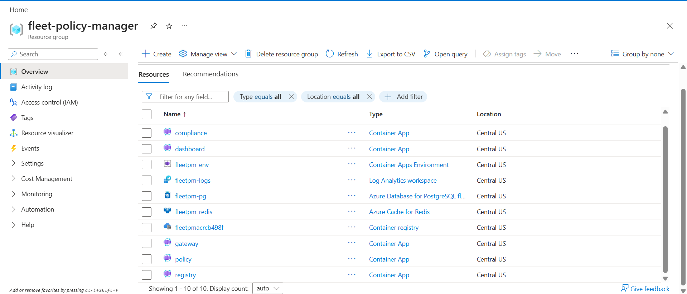
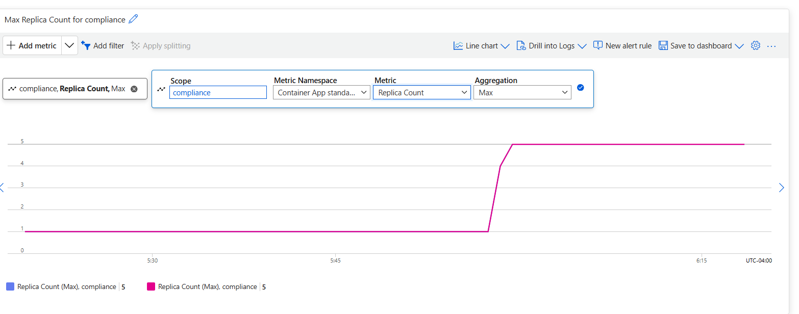
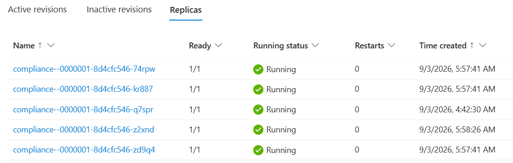
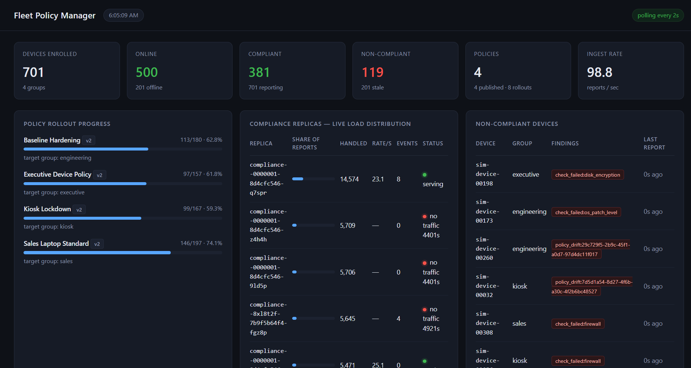
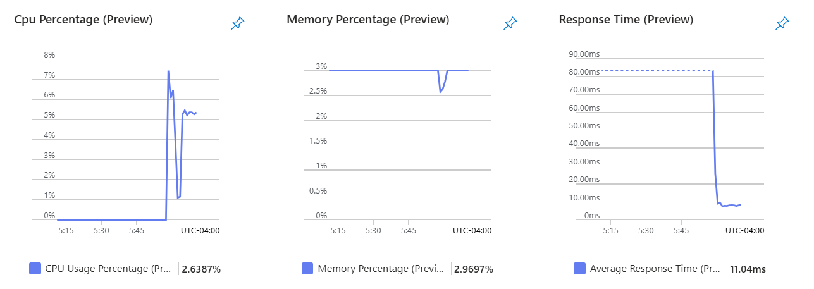

# Fleet Policy Manager

A microservices platform for managing a fleet of enrolled devices: registering
them, pushing configuration policies to groups of them, and continuously
tracking which devices have fallen out of compliance. It is built the way a real
device-management backend is built — independently deployable services, each
owning its own data, communicating over a mix of synchronous REST and an
asynchronous event bus, behind a single authenticated gateway.

The system ships with a load generator that simulates hundreds of devices
checking in at once, a live dashboard, and a scripted demonstration of the
platform surviving the loss of a service instance under load.

---

## What it does

- **Enrolls devices and tracks liveness.** Each device registers once, then
  sends periodic heartbeats. A device is considered online or offline based on
  how recently it last checked in.
- **Defines and rolls out policies.** An operator creates a configuration policy
  targeting a device group and publishes it. Publishing emits an event; it does
  not call the compliance service directly.
- **Evaluates compliance continuously.** Devices report their own posture —
  which policy versions they have applied, how their local security checks came
  out. The compliance service decides whether each device is compliant, because
  only it knows what the fleet is currently expected to be running.
- **Tracks rollout progress.** For every published policy, the dashboard shows
  how many targeted devices have actually converged on it.
- **Stays up when a piece fails.** The compliance service runs as several
  interchangeable instances behind a load balancer. Losing one is a latency
  blip, not an outage.

---

## Architecture

```
                              ┌──────────────────┐
   operator / dashboard ─────▶│                  │
                              │   API Gateway    │  authentication (API keys, two roles)
   device agents ────────────▶│   :8000          │  request routing
                              │                  │  shared-state rate limiting
                              └────────┬─────────┘
                                       │  REST
             ┌─────────────────────────┼──────────────────────────┐
             ▼                         ▼                          ▼
   ┌──────────────────┐     ┌──────────────────┐        ┌───────────────────┐
   │ Device Registry  │     │  Policy Service  │        │  Load Balancer    │
   │  Service :8001   │     │   :8002          │        │  (compliance)     │
   │                  │     │                  │        └─────────┬─────────┘
   │ enrollment       │     │ policy CRUD      │           least-connections
   │ heartbeats       │     │ versioned        │           health-checked
   │ group membership │     │ rollouts         │         ┌───────┼───────┐
   │                  │     │                  │         ▼       ▼       ▼
   │  SQLite (private)│     │  SQLite (private)│      ┌─────┐ ┌─────┐ ┌─────┐
   └──────────────────┘     └────────┬─────────┘      │ cmp │ │ cmp │ │ cmp │
                                     │                │  1  │ │  2  │ │  3  │
                          policy rollout events       └──┬──┘ └──┬──┘ └──┬──┘
                                     │                   └───────┼───────┘
                                     ▼                           ▼
                          ┌────────────────────┐        ┌───────────────────┐
                          │   Event Bus        │        │  PostgreSQL       │
                          │   (Redis streams,  │◀───────│  (shared by the   │
                          │   consumer group)  │ consume│   compliance      │
                          └────────────────────┘        │   instances only) │
                                                        └───────────────────┘
```

### Service boundaries

Each backend service runs as its own process and owns its own database. No
service opens another service's store, and none is given a connection string to
one. Anything a service needs about data another service owns, it gets over the
network or learns from an event.

| Service | Owns | Store | Why that store |
|---|---|---|---|
| Device Registry | device identity, enrollment, heartbeat liveness | SQLite | single writer, simple key-value-shaped access |
| Policy | policy definitions, versions, rollout history | SQLite | single writer, low write volume |
| Compliance | compliance verdicts, rollout convergence, per-instance load | PostgreSQL | runs as multiple instances that must share one consistent view |

The compliance service is the one that scales horizontally, and that decides its
store. A file-based database private to each instance would give three instances
three different answers to "how many devices are out of compliance." A shared
PostgreSQL database behind all the instances keeps them consistent — and it is
still a store private to one service, shared between copies of that service, not
between services.

### Synchronous where it needs an answer, asynchronous where it does not

The gateway talks to the services over REST because a caller is waiting for a
response. The Policy and Compliance services are wired together differently:
publishing a policy writes a **durable event** to a Redis stream and returns.
The Policy service does not know the Compliance service's address and never
blocks on it.

The Compliance service consumes that stream as a **named consumer group**. This
matters specifically because Compliance is scaled out: plain publish/subscribe
would deliver every rollout event to every instance, so three instances would
each apply the same rollout. A consumer group delivers each event to exactly one
instance, keeps unread events durably while an instance is restarting, and lets a
peer reclaim work that an instance took but died before finishing. A rollout
published while every Compliance instance is down is still waiting when they come
back.

### The gateway

Every caller — device agent, operator, dashboard — enters through the gateway,
and nothing behind it is reachable directly. It handles four concerns the
backend services deliberately leave out:

- **Authentication.** API keys resolve to one of two roles. `admin` has full
  access. `device` is scoped to exactly what an enrolled endpoint legitimately
  does: enroll itself, send heartbeats, post its own compliance reports, read
  the policy set for its group. A leaked device credential cannot author policy
  or enumerate the fleet.
- **Routing.** One public URL space (`/api/registry/…`, `/api/policy/…`,
  `/api/compliance/…`) mapped onto the private services. Compliance traffic is
  routed to the load balancer, so the gateway neither knows nor cares how many
  compliance instances exist.
- **Rate limiting.** A token bucket held in Redis and refilled continuously, so
  the limit is shared across every gateway worker process rather than being
  multiplied by their count. Buckets are keyed per credential, so one noisy
  device cannot exhaust the fleet's allowance.
- **Aggregation.** One endpoint fans out to all three services concurrently for
  the dashboard, and degrades section by section if any are down.

### High availability: horizontal scaling with failover

The one production-grade availability feature, built and load-tested:

- Three interchangeable Compliance instances sit behind an nginx load balancer
  using least-connections routing.
- The balancer health-checks each instance. After repeated failures an instance
  is pulled from rotation within seconds and re-probed later.
- If an instance dies mid-request, the balancer retries that same request
  against another instance, so an instance loss costs latency on a handful of
  requests rather than dropping them.
- Every instance shares the one PostgreSQL store, so no fleet state is tied to
  the instance that goes away.
- Each instance stamps every response it serves with its own identifier, so load
  distribution — and its recovery after a failure — is directly visible from
  outside the cluster and on the dashboard.

`tools/ha_failover_test.py` runs the full experiment: sample the baseline, stop
an instance mid-load, watch throughput recover on the survivors, restart it,
watch it rejoin.

### Bonus: graceful degradation

Falls out of the event-driven design rather than being built separately. If the
Policy service is stopped, policy authoring is unavailable but the Compliance
service keeps evaluating the fleet against the last rollout it heard about, the
gateway's aggregate endpoint returns `200` with policy marked degraded, and the
dashboard shows a degraded banner instead of a dead page.

---

## Running it

Requires Docker and Docker Compose. Nothing else — Python is only needed on the
host if you want to run the load generator outside a container.

### Start the whole platform

```bash
docker compose up -d --build
```

This starts ten containers: the three backend services, three compliance
instances, the compliance load balancer, the gateway, the dashboard, Redis, and
PostgreSQL. Give it about 25 seconds to become healthy, then check:

```bash
docker compose ps
curl -s http://localhost:8000/health | python3 -m json.tool
```

- Dashboard: **http://localhost:8090**
- Gateway API documentation: **http://localhost:8000/docs**

### Seed some policies

```bash
docker compose run --rm --no-deps --entrypoint python simulator \
  seed_policies.py --gateway http://gateway:8000
```

Creates and publishes one baseline policy per device group, so there are
rollouts for devices to converge on.

### Run the fleet simulator

In a container (no host setup):

```bash
docker compose run --rm simulator --devices 500 --duration 120
```

Or from the host, against the published gateway port:

```bash
python3 -m venv .venv && ./.venv/bin/pip install -r tools/requirements.txt
./.venv/bin/python tools/simulator.py --devices 500 --duration 120
```

The simulator spreads its virtual devices across worker processes (a single
process saturates before the platform does), ramps them online over a window
rather than all at once, and includes a cohort of devices that never converge
and a cohort with a failing security check — so the dashboard shows a realistic
mix rather than a flat 100%. Watch the dashboard update live while it runs.

Representative result, 500 devices, 4 worker processes, this development machine:

```
  total requests           8449
  sustained throughput     91.7 req/s      (≈50 compliance reports/s)
  latency p50 / p95 / p99  8.5ms / 20.3ms / 35.1ms
  errors                   0 (0.00%)
  Compliance instance distribution
    compliance-1   33.4%   compliance-2   33.3%   compliance-3   33.3%
```

### Demonstrate the high-availability feature

Start a load source in one shell:

```bash
docker compose run --rm simulator --devices 500 --duration 240
```

Run the failover experiment in another:

```bash
./.venv/bin/python tools/ha_failover_test.py --victim compliance-2
```

It stops a compliance instance mid-run and samples throughput and per-instance
load through the recovery. Abridged output from a real run:

```
--- BASELINE — all instances healthy ---
  t+   15s  ingest=  62.9/s  live_replicas=3/3  [compliance-1:21.7/s  compliance-2:20.5/s  compliance-3:20.7/s]

  >>> stopping compliance-2 now
--- DEGRADED — running on two instances ---
  t+   32s  ingest=  61.1/s  live_replicas=2/3  [compliance-1:30.8/s  compliance-2:0.0/s (no traffic)  compliance-3:30.2/s]
  t+   57s  ingest=  57.4/s  live_replicas=2/3  [compliance-1:27.9/s  compliance-2:0.0/s (no traffic)  compliance-3:29.5/s]

  >>> starting compliance-2 again
--- RECOVERY — instance rejoining ---
  t+   84s  ingest=  61.2/s  live_replicas=3/3  [compliance-1:20.7/s  compliance-2:19.3/s  compliance-3:21.1/s]

RESULT: instances serving traffic again 3/3 — reports accepted throughout, none dropped
```

Throughput holds as load shifts to the surviving two instances, then rebalances
when the third returns.

### Try graceful degradation

```bash
docker compose stop policy
curl -s http://localhost:8000/health | python3 -m json.tool     # 200, policy marked unreachable
curl -s -H "X-API-Key: fleet-admin-key" http://localhost:8000/api/fleet/summary | python3 -m json.tool
docker compose start policy
```

The dashboard shows a degraded banner while policy is down and clears it when
policy returns.

### Stop it

```bash
docker compose down          # stop, keep data
docker compose down -v        # stop and wipe all data
```

A `Makefile` wraps these as `make up`, `make seed`, `make simulate`,
`make failover`, `make clean`.

---

## Deployment to Azure

The same platform runs on **Azure Container Apps** with managed backing
services. The application images are identical to the local ones — every
difference is configuration in [`infra/main.bicep`](infra/main.bicep).

### Live deployment

Deployed and load-tested on Azure. One resource group holds the whole platform:
the Container Apps environment and six apps, Azure Cache for Redis, Azure
Database for PostgreSQL, a container registry and a Log Analytics workspace.



Driving 700 simulated devices through the public gateway put **~50,000 requests
at roughly 200 per second with zero errors**, and the Compliance service
**autoscaled from 1 to 5 replicas** on request concurrency — the platform
ingress spreading load across every replica.

| Compliance replica count during the load test | Replicas running at peak |
|---|---|
|  |  |

The dashboard, served from its own Container App, reads the whole fleet through
the public gateway — devices online, policy rollout convergence, per-replica
load, and flagged devices:



Through the same run, each Compliance replica held **~11 ms average response
time** at 2–3% CPU:



### Cloud architecture

```
        Internet
           │
           ▼
   ┌───────────────┐        ┌───────────────┐
   │   gateway     │        │   dashboard   │      external ingress (public HTTPS)
   │ (public FQDN) │        │ (public FQDN) │
   └───────┬───────┘        └───────┬───────┘
           │   internal ingress     │
   ┌───────┴────────────────────────┘
   ▼           ▼                 ▼
┌────────┐ ┌────────┐   ┌──────────────────────┐
│registry│ │ policy │   │     compliance       │   1..N replicas, autoscaled
│ 1 rep  │ │ 1 rep  │   │  platform ingress     │   by the Container Apps
│ephem.  │ │ephem.  │   │  load-balances across │   ingress + KEDA
└────────┘ └───┬────┘   │  replicas             │
               │        └──────┬───────────────┘
      policy rollout events    │
               ▼               ▼
   ┌────────────────────┐  ┌──────────────────────────────┐
   │ Azure Cache for    │  │ Azure Database for PostgreSQL │
   │ Redis (Basic C0)   │  │ Flexible Server (Burstable)   │
   │ event bus          │  │ compliance store             │
   └────────────────────┘  └──────────────────────────────┘
```

| Local (compose) | Azure |
|---|---|
| `registry`, `policy`, `compliance` containers | Container Apps, **internal** ingress |
| `compliance-lb` (nginx) | **removed** — the platform ingress load-balances across `compliance` replicas |
| `gateway`, `dashboard` containers | Container Apps, **external** ingress (public HTTPS FQDN) |
| `redis` container | Azure Cache for Redis, Basic C0, TLS-only |
| `compliance-db` (postgres container) | Azure Database for PostgreSQL Flexible Server, Burstable B1ms |
| 3 fixed `compliance` replicas | `compliance` autoscales 1→5 on HTTP concurrency, plus a KEDA rule on event-bus consumer lag |

The horizontal-scaling story is stronger here than locally: replica count is
driven by real load rather than fixed at three, and the platform's own ingress
does the load balancing. Each replica still tags its responses with a unique
identifier, so `GET /api/compliance/stats` shows the live per-replica split.

### Deploy it

Everything is scripted. Requires the [Azure CLI](https://learn.microsoft.com/cli/azure/install-azure-cli),
Docker, and an Azure subscription.

```bash
az login
az extension add --name containerapp --upgrade

./infra/deploy.sh --what-if     # preview: creates only the resource group + registry
./infra/deploy.sh               # build, push, deploy everything
```

`deploy.sh` creates a resource group and a container registry, builds all six
images locally with Docker and pushes them, deploys everything else from the
Bicep template, and prints the public URLs and the generated API keys.

Images are built locally rather than with `az acr build` because ACR Tasks are
not available on every subscription (Azure for Students blocks them). The
default region is `centralus`; if your subscription restricts regions, set
`LOCATION` to an allowed one:

```bash
az policy assignment list --query "[?displayName=='Allowed resource deployment regions'].parameters"
LOCATION=canadacentral ./infra/deploy.sh
```

```bash
./infra/loadtest-cloud.sh 500 240      # seed policies, run the simulator, watch replicas scale
./infra/teardown.sh                    # delete everything
./infra/teardown.sh --pause            # or just stop the hourly-billed resources
```

### Failover, in the cloud

While `loadtest-cloud.sh` is running, restart Compliance replicas from another
shell:

```bash
az containerapp revision restart --name compliance --resource-group fleet-policy-manager \
  --revision "$(az containerapp revision list --name compliance --resource-group fleet-policy-manager --query '[0].name' -o tsv)"
```

The report count keeps climbing and no requests fail — the platform ingress
stops routing to replicas that fail their health probe and resumes when they
recover, the same behaviour the local nginx load balancer demonstrates.

### Cost and teardown

| Resource | While running | Paused | Deleted |
|---|---|---|---|
| Azure Cache for Redis (Basic C0) | ~$16/mo | **cannot pause** | $0 |
| PostgreSQL Flexible Server (B1ms) | ~$13/mo | ~$4/mo (storage only) | $0 |
| Container Registry (Basic) | ~$5/mo | ~$5/mo | $0 |
| Container Apps | pennies idle, more under load | scale to minimum | $0 |
| Log Analytics | a few $/mo at demo volume | minimal | $0 |

**Redis on Basic tier cannot be stopped — only deleted.** `teardown.sh` deletes
the whole resource group by default; `teardown.sh --pause` deletes Redis and
stops PostgreSQL, dropping the standing cost to roughly $9/mo, and the next
`deploy.sh` rebuilds Redis and redeploys.

### Known limitations of the demo deployment

- **Basic-tier Redis has no persistence or replica.** If the platform reboots
  the cache, undelivered events in the stream are lost. The Compliance consumer
  reclaims in-flight work on reconnect, and policy-rollout volume is low, so
  this is acceptable for a demo; Standard tier adds a replica, Premium adds
  persistence.
- **Registry and Policy use ephemeral storage.** Their SQLite data resets on a
  revision restart. The simulator re-enrolls devices and `seed_policies.py`
  re-publishes policies within seconds. Azure Files volumes would make them
  durable at the cost of SMB file-locking quirks.
- **ACR admin credentials** are used for image pulls. Managed identity with an
  `AcrPull` role assignment is the hardening step, left out here because it
  needs a higher privilege level to deploy.
- **Database reachable from Azure services.** The PostgreSQL firewall allows
  Azure-internal traffic rather than a private VNet. VNet integration is the
  production posture.

---

## Repository layout

```
services/
  registry/     Device Registry Service    — FastAPI + SQLite
  policy/       Policy Service              — FastAPI + SQLite + event publisher
  compliance/   Compliance Service          — FastAPI + PostgreSQL + event consumer
  gateway/      API Gateway                 — FastAPI: auth, routing, rate limiting
shared/
  fleetcommon/  config, structured logging, and the event-bus wrapper shared by all services
loadbalancer/   nginx configuration for the compliance instances
dashboard/      live fleet dashboard        — FastAPI + server-rendered templates
tools/
  simulator.py           multi-process virtual device fleet
  seed_policies.py        starter policy set
  ha_failover_test.py     scripted failover demonstration
infra/
  main.bicep             Azure Container Apps deployment (all resources)
  deploy.sh              build images, deploy, print URLs
  loadtest-cloud.sh      run the simulator against the deployed environment
  teardown.sh            delete or pause the Azure resources
docs/
  ARCHITECTURE.md         design rationale and request-path walkthroughs
docker-compose.yml        the entire platform, one command
```

---

## Design notes and trade-offs

- **SQLite for two services, PostgreSQL for one.** Driven entirely by whether the
  service scales horizontally. Registry and Policy have a single writer;
  Compliance has several and needs them consistent. See
  [`docs/ARCHITECTURE.md`](docs/ARCHITECTURE.md) for the fuller reasoning.
- **Redis streams with a consumer group, not publish/subscribe.** Publish/
  subscribe is simpler but silently wrong once the consumer is scaled out —
  every instance would process every event. This is called out because it is a
  real design decision, not an incidental library choice.
- **Compliance report durability is deliberately relaxed.** Compliance reports
  are high-frequency, self-superseding telemetry — the next report from a device
  replaces the last within seconds. The compliance database is configured to
  group-commit these rather than flush each one, which is what lifts fleet
  ingest from roughly 50 to over 600 reports per second on this machine. Policy
  definitions and device enrollment, where a lost write would matter, live in
  other services and are unaffected.
- **Instance load counters are held in memory and flushed periodically.**
  Counting inside the request transaction serialised every request on one
  database row and capped each instance near 48 requests per second. The cost of
  moving it out is losing up to one flush interval of an instance's own metrics
  if it is killed — an acceptable trade for a metric.
- **The dashboard has no database.** Every figure it shows is read live through
  the gateway, using the same authenticated, rate-limited path a device or an
  operator's script uses. It holds the gateway credential server-side and never
  ships it to the browser.
- **Scope deliberately left out:** TLS between services, a real identity provider,
  device certificate enrollment, policy conflict resolution when two policies
  target overlapping groups, and persistent historical metrics. Each is a known
  extension point, not an oversight.

---

## Author

**Mitul Goel** &nbsp;·&nbsp; <a href="https://github.com/Mitulol" style="color:#1a5fb4;text-decoration:underline">github.com/Mitulol</a> &nbsp;·&nbsp; <a href="https://linkedin.com/in/mitul-goel" style="color:#1a5fb4;text-decoration:underline">linkedin.com/in/mitul-goel</a><br>
University of Michigan
